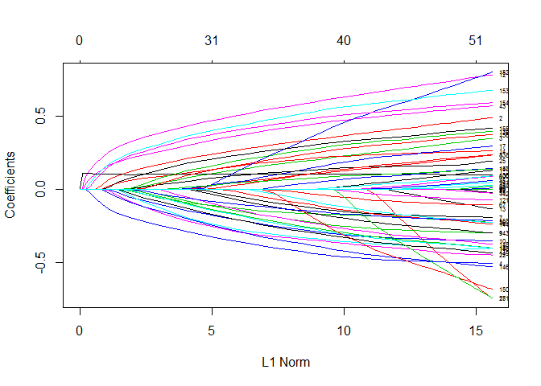
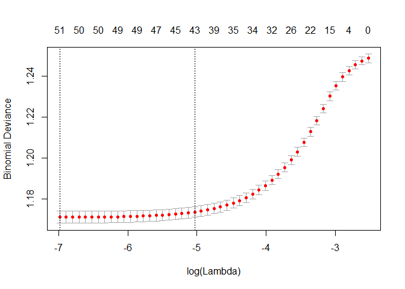
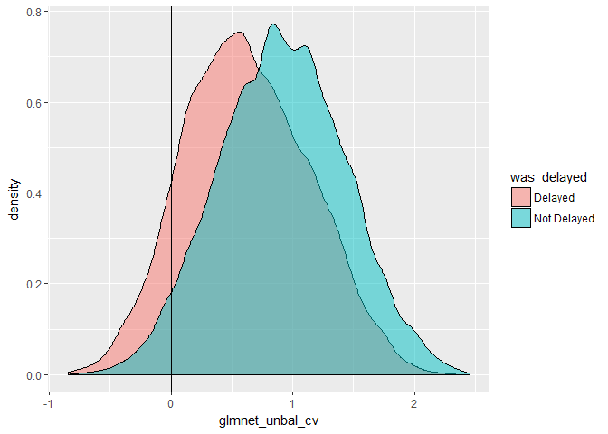

Applied Data Science
================

Packages
--------

Packages we'll look at today:

-   odbc / readxl / readr / dbplyr for data access
-   tidyverse for data manipulation
-   DataExplorer for helping us providing our EDA of the data
-   modelr / rsamples for sampling strategy
-   recipes for performing feature engineering
-   glmnet / glmnetUtils / h2o / FFTrees for building models
-   yardstick / broom for evaluation
-   rmarkdown for documentation

Working with databases
----------------------

We need a database connection before we can do anything with our database

``` r
library(DBI)  # talk with databases, a driver
library(odbc) # allows us to talk with DBI drivers

driver = "SQL server" # prgram that allows us to talk with the database
server = "fbmcsads.database.windows.net"
database = "WideWorldImporters-Standard"
uid = "adatumadmin"
pwd = "Pa55w.rdPa55w.rd"


con <- dbConnect(odbc(),
                 driver = driver,
                 server = server,
                 database = database,
                 uid = uid,
                 pwd = pwd)
```

Now that we have a DB connection, we can write SQL in a code chunk.

``` sql
select top 5 * from flights
```

|  year|  month|  day|  dep\_time|  sched\_dep\_time|  dep\_delay|  arr\_time|  sched\_arr\_time|  arr\_delay| carrier |  flight| tailnum | origin | dest |  air\_time|  distance|  hour|  minute| time\_hour          |
|-----:|------:|----:|----------:|-----------------:|-----------:|----------:|-----------------:|-----------:|:--------|-------:|:--------|:-------|:-----|----------:|---------:|-----:|-------:|:--------------------|
|  2013|      1|    1|        517|               515|           2|        830|               819|          11| UA      |    1545| N14228  | EWR    | IAH  |        227|      1400|     5|      15| 2013-01-01 05:00:00 |
|  2013|      1|    1|        533|               529|           4|        850|               830|          20| UA      |    1714| N24211  | LGA    | IAH  |        227|      1416|     5|      29| 2013-01-01 05:00:00 |
|  2013|      1|    1|        542|               540|           2|        923|               850|          33| AA      |    1141| N619AA  | JFK    | MIA  |        160|      1089|     5|      40| 2013-01-01 05:00:00 |
|  2013|      1|    1|        544|               545|          -1|       1004|              1022|         -18| B6      |     725| N804JB  | JFK    | BQN  |        183|      1576|     5|      45| 2013-01-01 05:00:00 |
|  2013|      1|    1|        554|               600|          -6|        812|               837|         -25| DL      |     461| N668DN  | LGA    | ATL  |        116|       762|     6|       0| 2013-01-01 06:00:00 |

We can use dbplyr to construct dplyr commands that work on the DB.

``` r
library(dbplyr) # translates into sql 
library(tidyverse) # group_by and filter and stuff in this package
```

    ## -- Attaching packages ----------------------------------------------------------------- tidyverse 1.2.1 --

    ## v ggplot2 2.2.1     v purrr   0.2.4
    ## v tibble  1.4.2     v dplyr   0.7.4
    ## v tidyr   0.8.0     v stringr 1.3.0
    ## v readr   1.1.1     v forcats 0.2.0

    ## -- Conflicts -------------------------------------------------------------------- tidyverse_conflicts() --
    ## x dplyr::filter() masks stats::filter()
    ## x dplyr::ident()  masks dbplyr::ident()
    ## x dplyr::lag()    masks stats::lag()
    ## x dplyr::sql()    masks dbplyr::sql()

``` r
flights_tbl <- tbl(con, "flights")  # talk with database con and flights table

flights_tbl %>% 
  filter(month<=6) %>%  
  group_by(origin) %>% 
  summarise(n = n(), # n is number of rows
            mean_dist = mean(distance)) %>% 
  show_query()
```

    ## <SQL>
    ## SELECT "origin", COUNT(*) AS "n", AVG("distance") AS "mean_dist"
    ## FROM "flights"
    ## WHERE ("month" <= 6.0)
    ## GROUP BY "origin"

We can also work with tables that aren't in the default schema.

``` r
purchaseorders_tbl <-tbl(con, in_schema("purchasing", "purchaseorders")) # selects purchaseorders in purchasing 

purchaseorders_tbl %>%  
  top_n(5)
```

    ## Selecting by LastEditedWhen

    ## # Source:   lazy query [?? x 12]
    ## # Database: Microsoft SQL Server
    ## #   12.00.0300[dbo@fbmcsads/WideWorldImporters-Standard]
    ##   PurchaseOrderID SupplierID OrderDate  DeliveryMethodID ContactPersonID
    ##             <int>      <int> <chr>                 <int>           <int>
    ## 1            2073          4 2016-05-31                7               2
    ## 2            2074          7 2016-05-31                2               2
    ## 3            2071          4 2016-05-30                7               2
    ## 4            2072          7 2016-05-30                2               2
    ## 5            2068          4 2016-05-27                7               2
    ## 6            2069          7 2016-05-27                2               2
    ## 7            2070          4 2016-05-28                7               2
    ## # ... with 7 more variables: ExpectedDeliveryDate <chr>,
    ## #   SupplierReference <chr>, IsOrderFinalized <lgl>, Comments <chr>,
    ## #   InternalComments <chr>, LastEditedBy <int>, LastEditedWhen <chr>

We can use the 'Id()' function from DBI to work with schema more generically within a database. This means we aren't restricted to just SELECT statements.

``` r
# error = true, we will se the error code it generated
dbGetQuery(con,"CREATE SCHEMA DBIexample5")  # insert a number for your examlpe
```

    ## Error: <SQL> 'CREATE SCHEMA DBIexample5'
    ##   nanodbc/nanodbc.cpp:1587: 42S01: [Microsoft][ODBC SQL Server Driver][SQL Server]There is already an object named 'DBIexample5' in the database.

``` r
dbWriteTable(con,"iris", iris, overwrite = TRUE)
#Read from newly written table
head(dbReadTable(con,"iris"))
```

    ##   Sepal.Length Sepal.Width Petal.Length Petal.Width Species
    ## 1          5.1         3.5          1.4         0.2  setosa
    ## 2          4.9         3.0          1.4         0.2  setosa
    ## 3          4.7         3.2          1.3         0.2  setosa
    ## 4          4.6         3.1          1.5         0.2  setosa
    ## 5          5.0         3.6          1.4         0.2  setosa
    ## 6          5.4         3.9          1.7         0.4  setosa

``` r
#Read from a table in a schema
head(dbReadTable(con, Id(schema="20774A", table = "CustomerTransactions")))
```

    ## Note: method with signature 'DBIConnection#SQL' chosen for function 'dbQuoteIdentifier',
    ##  target signature 'Microsoft SQL Server#SQL'.
    ##  "OdbcConnection#character" would also be valid

    ##                  CustomerName TransactionAmount OutstandingBalance
    ## 1             Aakriti Byrraju           2645.00                  0
    ## 2                  Bala Dixit            465.75                  0
    ## 3 Tailspin Toys (Head Office)            103.50                  0
    ## 4 Tailspin Toys (Head Office)            511.98                  0
    ## 5                Sara Huiting            809.60                  0
    ## 6                Alinne Matos            494.50                  0
    ##   TaxAmount PKIDDate TransactionDate
    ## 1    345.00 20130101      2013-01-01
    ## 2     60.75 20130101      2013-01-01
    ## 3     13.50 20130101      2013-01-01
    ## 4     66.78 20130101      2013-01-01
    ## 5    105.60 20130101      2013-01-01
    ## 6     64.50 20130101      2013-01-01

``` r
#If a write methid is supportewd by the driver, this will work
dbWriteTable(con, Id(schema="DBIexampleMitra", table = "iris", iris, overwrite = TRUE))
```

    ## Error in validObject(.Object): invalid class "Id" object: invalid object for slot "name" in class "Id": got class "list", should be or extend class "character"

Some of our code could fail in that section so we used 'error=TRUE' to be able to carry on even if some of the code error-ed. Great for optional code or things with bad connections.

Exploratory
-----------

``` r
## eval = FALSE, should evaluate this chunk of code or not, when I nit it.
flights_tbl %>% 
  as_data_frame() %>% 
  DataExplorer::GenerateReport()
```

Questions arising from the basic report:

1.  Why is there a day with double the number of flights?
2.  We need to address the high correlation between time columns
3.  Why is there negative correlation between 'flight' and 'distance'?
4.  Do we need to do anything about missings or can we just remove the rows
5.  look up why there is a peak in middle of the month?

Things to implement later in the workflow due to the EDA (explorer tree data analysis):

1.  We need to address the high correlation between time columns
2.  We need to group low freq airlines carries
3.  Bi variate for analyzing two things in relation to each other

### Answering our questions

> Why is there a day with double the number of flights?

Are there duplicate rows?

``` r
flights_tbl %>% 
  filter(day == 15) %>% 
  distinct()  %>%  
  summarise(n())  %>%  # count the data
  as_data_frame() ->  # force it to give it the content and not sql code
  distict_count  # create a uniqe list of using distict count
  
  # get all rows if dublicate or not
flights_tbl %>% 
  filter(day == 15) %>% 
  summarise(n())  %>%  
  as_data_frame() ->
  row_count 

# if the sructure and values are the same return true,
identical(row_count, distict_count) #one row per observed flight?
```

    ## [1] TRUE

But are the number of rows unusual?

``` r
library(ggplot2)
flights_tbl %>% 
  group_by(day) %>% 
  summarise(n = n(), n_distinct(flight)) %>% 
  arrange(day)
```

    ## # Source:     lazy query [?? x 3]
    ## # Database:   Microsoft SQL Server
    ## #   12.00.0300[dbo@fbmcsads/WideWorldImporters-Standard]
    ## # Ordered by: day
    ##      day     n `n_distinct(flight)`
    ##    <int> <int>                <int>
    ##  1     1 11036                 2532
    ##  2     2 10808                 2542
    ##  3     3 11211                 2491
    ##  4     4 11059                 2449
    ##  5     5 10858                 2463
    ##  6     6 11059                 2484
    ##  7     7 10985                 2427
    ##  8     8 11271                 2436
    ##  9     9 10857                 2496
    ## 10    10 11227                 2504
    ## # ... with more rows

``` r
## to plot the data instead : 
flights_tbl %>% 
  group_by(day) %>% 
  summarise(n = n(), n_distinct(flight)) %>%
  as_data_frame() %>% 
  ggplot(aes(day,y = n)) + geom_col()  # does not do any binning of the data
```

 Data is fine, the problem is in our visualization. Doing histogram, split continues numbers have to group them two in a day. the spike looks to be a problem but its not.

Looks like the jump in the histogram is an artifact of binning the data. s'oh!

### Bivariate analysis

``` r
flights_tbl %>% 
  select_if(is.numeric) %>% 
  as_data_frame() %>%   # need to convert to a data frame from sql data
  gather(col,val,-dep_delay) %>% # dont pivot the dep_delay column, gather and pivot creates the variables col and val
  filter(col!= "arr_delay", dep_delay < 500) %>%  # filter out arr_delay to see better result
  ggplot(aes(x=val, y=dep_delay)) + 
  #geom_point() +  # this takes long time since its plotting row by row
  geom_bin2d() +
  facet_wrap(~col, scales = "free") + # takes different parts of our data to produce them as charts
  scale_fill_gradientn(colours= viridisLite::viridis(256, option = "D"))
```

    ## Applying predicate on the first 100 rows

    ## Warning: Removed 1631 rows containing non-finite values (stat_bin2d).

    ## Warning: Computation failed in `stat_bin2d()`:
    ## 'from' must be a finite number


### Sampling

Our options for sampling data with large class imbalance are:

-   Down sampling takes as many majority rows and there are minority rows
    -   No over fit from individual rows
    -   Can drastically reduce training data size
-   Up sampling or sampling repeats minority rows until they meet some defined class ratio
    -   Risks over fitting
    -   Doesn't reduce training data set
-   Synthesizing data makes extra records that are like the minority class
    -   Does not reduce training set
    -   Avoids some of the over fit risk of up sampling
    -   Can weaken predictions if minority data is very similar to majority
    -   synthpop is a package used.

We need to think about whether we need to k-fold cross-validation explicitly.

-   Run the same model and assess robustness of the coefficients
-   We have an algorithm that needs explicit cross validation because it does not do it internally
-   When we are going to run lots of models with hyper-parameter tuning so the results are more consistent.

We use bootstrapping when we want to fit a single model and ensure the results are robust. This will often do many more iterations than k-fold cross validation, making it better in cases where there is relatively small amounts of data. (Bootstrapping is used to arrive at a single robust model)

Packages we can use for sampling include:

-   modelr which facilitates boostrap and cross validation strategies
-   rsample allows us to bootstrap and perform a wide variety of cross validation tasks
-   recipes allows us to up sample and down sample
-   synthpop allows us to build synthesized samples

More notes: - we have many underlays (= majority of the data), how can we predict when the flights are late, now it will always say that the flights are on time... what to do? - Down sampling = if we have alot of data, take randome small sample of the not delayed majority class data and still have a huge amount of data, having more data of delayed. - upsampling = a model to predict 3 % that are delay, repeat those rows which are delays, known minority class rows, until we have 15 - 20% delays. - synthesize data, is the third option

Hyperparameter tunings - Use training data - Split our data into training and test set. 4/5 split,

Need to test different models to select the one that gives the best result.

### Install

from github, it is CRAN but we have an earlier version
======================================================

run in console &gt;
===================

install.packages("devtools")
============================

devtools::install\_github("topepo/recipes")
===========================================

### Practical

First we need to split our data into test and train.

``` r
flights_tbl %>% 
  as_data_frame() ->
  flights

flights %>% 
  mutate(was_delayed = ifelse(arr_delay>5, "Delayed", "Not Delayed"), week = ifelse(day %/% 7 >3, 3, day %/% 7))  -> # flight delayed with 5 min & %/% makes absolute division (decimal < 1 becomes 0 when doing division and 1 when one 7 fits to the value, 2 for 2 7:ns osv..), we create weeks, 
  flights

flights %>% 
  modelr::resample_partition(c(train=0.7, test =0.3)) ->
  splits

splits %>% 
  pluck("train") %>% 
  as_data_frame() ->
  train_raw

splits %>% 
  pluck("test") %>% 
  as_data_frame() ->
  test_raw
```

Druring the investigation, we will look at the impact of upsampling. We will see it in action in a bit. First prepping our basic features!

``` r
library(recipes)
```

    ## Loading required package: broom

    ## 
    ## Attaching package: 'recipes'

    ## The following object is masked from 'package:stringr':
    ## 
    ##     fixed

    ## The following object is masked from 'package:stats':
    ## 
    ##     step

``` r
basic_fe <- recipe(train_raw, was_delayed ~ .)  # ~ . = by everything to predict was_delayed data # feature engineering

basic_fe %>% 
  step_rm(ends_with("time"), ends_with("delay"), 
          year, day, minute, time_hour, tailnum, flight) %>% 
#  step_corr(all_predictors()) %>%  # remove highly corr variables
  step_zv(all_predictors()) %>% # remove parameters with near zero variance
  step_nzv(all_predictors()) %>%  # drop param. if freq is less than 5 % that has differences
  step_naomit(all_predictors()) %>% #remove recors that are NA, because they are only 3%
  step_naomit(all_outcomes()) %>%
  step_other(all_nominal(), threshold = 0.03) ->  # if they have values with low incident rate to a low category, other category. nominal = categorical variable
 # step_discretize(month, day) ->  #convert from numbers to category variables
  colscleaned_fe
  
colscleaned_fe
```

    ## Data Recipe
    ## 
    ## Inputs:
    ## 
    ##       role #variables
    ##    outcome          1
    ##  predictor         20
    ## 
    ## Operations:
    ## 
    ## Delete terms ends_with("time"), ends_with("delay"), year, ...
    ## Zero variance filter on all_predictors()
    ## Sparse, unbalanced variable filter on all_predictors()
    ## Removing rows with NA values in all_predictors()
    ## Removing rows with NA values in all_outcomes()
    ## Collapsing factor levels for all_nominal()

``` r
colscleaned_fe <- prep(colscleaned_fe, verbose = TRUE)
```

    ## oper 1 step rm [training] 
    ## oper 2 step zv [training] 
    ## oper 3 step nzv [training] 
    ## oper 4 step naomit [training] 
    ## oper 5 step naomit [training] 
    ## oper 6 step other [training]

``` r
colscleaned_fe
```

    ## Data Recipe
    ## 
    ## Inputs:
    ## 
    ##       role #variables
    ##    outcome          1
    ##  predictor         20
    ## 
    ## Training data contained 235743 data points and 6641 incomplete rows. 
    ## 
    ## Operations:
    ## 
    ## Variables removed dep_time, sched_dep_time, arr_time, ... [trained]
    ## Zero variance filter removed no terms [trained]
    ## Sparse, unbalanced variable filter removed no terms [trained]
    ## Removing rows with NA values in all_predictors()
    ## Removing rows with NA values in all_outcomes()
    ## Collapsing factor levels for carrier, origin, dest, was_delayed [trained]

``` r
# do what we prepped to do
train_prep1 <- bake(colscleaned_fe, train_raw)
```

Now we need to process our numeric variables.

``` r
colscleaned_fe %>% 
  step_num2factor(month, week, hour) %>% # factors the numbers into classifications
  step_rm(tailnum) %>% #hack! now removed!
  step_log(distance) ->
  numscleaned_fe

numscleaned_fe <- prep(numscleaned_fe, verbose = TRUE)
```

    ## oper 1 step rm [pre-trained]
    ## oper 2 step zv [pre-trained]
    ## oper 3 step nzv [pre-trained]
    ## oper 4 step naomit [pre-trained]
    ## oper 5 step naomit [pre-trained]
    ## oper 6 step other [pre-trained]
    ## oper 7 step num2factor [training] 
    ## oper 8 step rm [training] 
    ## oper 9 step log [training]

``` r
numscleaned_fe
```

    ## Data Recipe
    ## 
    ## Inputs:
    ## 
    ##       role #variables
    ##    outcome          1
    ##  predictor         20
    ## 
    ## Training data contained 235743 data points and 6641 incomplete rows. 
    ## 
    ## Operations:
    ## 
    ## Variables removed dep_time, sched_dep_time, arr_time, ... [trained]
    ## Zero variance filter removed no terms [trained]
    ## Sparse, unbalanced variable filter removed no terms [trained]
    ## Removing rows with NA values in all_predictors()
    ## Removing rows with NA values in all_outcomes()
    ## Collapsing factor levels for carrier, origin, dest, was_delayed [trained]
    ## Factor variables from month, week, hour [trained]
    ## Variables removed tailnum [trained]
    ## Log transformation on distance [trained]

``` r
train_prep1 <- bake(numscleaned_fe, train_raw)
```

W00t its upsampling time!

``` r
# mean(train_prep1$was_delayed,na.rm =TRUE)  # just to check the mean
numscleaned_fe %>% 
  step_upsample(all_outcomes(), ratio = 1.) %>%  # increase to 50 % ratio between 
  prep(retain = TRUE) %>% 
  juice() %>% 
  #hack because juice is not reducing the column set
  bake(numscleaned_fe, .) ->
  train_prep2
```

Building models
---------------

Decide which types of models you want to consider -- perhaps using Microsoft's lovely [cheat sheet](https://docs.microsoft.com/en-us/azure/machine-learning/studio/algorithm-cheat-sheet). Then determine if any need any special processing to the data beyond what you have done so far.

### A basic logistic regression model

``` r
glm_unbal <- glm(was_delayed~ . -1,"binomial", data = train_prep1) # "was_delayed"" = input variable AND "~ ."" = output variable
glm_bal <- glm(was_delayed~ . -1, "binomial", data = train_prep2) # general linearized model, general regression model
```

Then we can see how these models are constructed and how they perform

``` r
library(broom)
glance(glm_unbal)  # model obj linear model, coeff values, how we change prop of an outcome...
```

    ##   null.deviance df.null   logLik      AIC      BIC deviance df.residual
    ## 1      117794.8   84971 -49709.8 99523.61 100009.8 99419.61       84919

``` r
# BIC = how much information we are collecting
# logLik = measure of what predicted and what happened ?? come back to this later
```

Get the coefficients of the model

``` r
tidy(glm_unbal)
```

    ##         term      estimate  std.error    statistic      p.value
    ## 1     month1 -0.8748308528 4.21182498  -0.20770826 8.354568e-01
    ## 2    month10 -0.5121757317 4.21171527  -0.12160740 9.032100e-01
    ## 3    month11 -0.6533975815 4.21171624  -0.15513808 8.767125e-01
    ## 4    month12 -1.5249247465 4.21163478  -0.36207431 7.172965e-01
    ## 5     month2 -1.0202423568 4.21170369  -0.24223982 8.085943e-01
    ## 6     month3 -0.9161618717 4.21180553  -0.21752236 8.278013e-01
    ## 7     month4 -1.2110548745 4.21165614  -0.28754837 7.736925e-01
    ## 8     month5 -0.7697390847 4.21172594  -0.18276096 8.549856e-01
    ## 9     month6 -1.3190879067 4.21155168  -0.31320710 7.541233e-01
    ## 10    month7 -1.3720486575 4.21179225  -0.32576361 7.446032e-01
    ## 11    month8 -1.0193926776 4.21175219  -0.24203529 8.087528e-01
    ## 12    month9 -0.2167358695 4.21182964  -0.05145884 9.589599e-01
    ## 13 carrierAA  0.4229357925 0.06339111   6.67184739 2.526032e-11
    ## 14 carrierB6 -0.0777286762 0.06287384  -1.23626419 2.163604e-01
    ## 15 carrierDL  0.4618461385 0.06336442   7.28873029 3.128897e-13
    ## 16 carrierEV -0.2384537271 0.07614615  -3.13152687 1.738999e-03
    ## 17 carrierMQ -0.2933592895 0.06957235  -4.21660725 2.480054e-05
    ## 18 carrierUA  0.1551365789 0.06438702   2.40943884 1.597707e-02
    ## 19 carrierUS  0.3704617785 0.07146977   5.18347526 2.177891e-07
    ## 20 carrierWN -0.6755483290 0.35552077  -1.90016556 5.741140e-02
    ## 21 originJFK  0.0159193152 0.02450480   0.64964082 5.159243e-01
    ## 22 originLGA -0.0004988919 0.02360819  -0.02113215 9.831402e-01
    ## 23   destBOS  1.0268517652 0.87317920   1.17599201 2.395981e-01
    ## 24   destCLT  0.2497710196 0.20867090   1.19696144 2.313216e-01
    ## 25   destFLL  0.0801443602 0.22056250   0.36336350 7.163334e-01
    ## 26   destLAX  0.0900339902 0.75152570   0.11980161 9.046403e-01
    ## 27   destMCO  0.2766275451 0.14206119   1.94724217 5.150571e-02
    ## 28   destMIA  0.1775403160 0.23336126   0.76079600 4.467789e-01
    ## 29   destORD  0.3482461064 0.04526665   7.69321623 1.434817e-14
    ## 30   destSFO -0.0233446074 0.77861152  -0.02998236 9.760811e-01
    ## 31  distance  0.2460109986 0.63562120   0.38704027 6.987264e-01
    ## 32    hour11  0.1612049040 0.05126425   3.14458732 1.663213e-03
    ## 33    hour12 -0.0946158923 0.04664866  -2.02826591 4.253312e-02
    ## 34    hour13 -0.1892946760 0.04651283  -4.06973016 4.706762e-05
    ## 35    hour14 -0.2783550624 0.04646561  -5.99056104 2.091184e-09
    ## 36    hour15 -0.5551664734 0.04390630 -12.64434581 1.202210e-36
    ## 37    hour16 -0.4939688949 0.04587315 -10.76814937 4.866853e-27
    ## 38    hour17 -0.6546981164 0.04387881 -14.92059851 2.420921e-50
    ## 39    hour18 -0.7859509056 0.04534136 -17.33408403 2.601790e-67
    ## 40    hour19 -0.6561791493 0.04589700 -14.29677588 2.291839e-46
    ## 41    hour20 -0.6327271780 0.04828038 -13.10526617 3.071827e-39
    ## 42    hour21 -0.6910989049 0.05173012 -13.35970116 1.039807e-40
    ## 43    hour22 -0.9625246353 0.13554672  -7.10105430 1.238087e-12
    ## 44    hour23 -1.0475888672 0.25820526  -4.05719415 4.966579e-05
    ## 45     hour5  0.5966958924 0.11818580   5.04879503 4.446054e-07
    ## 46     hour6  0.4440917093 0.04479257   9.91440610 3.603934e-23
    ## 47     hour7  0.3546293264 0.04714693   7.52179076 5.403101e-14
    ## 48     hour8  0.1822256543 0.04602372   3.95938553 7.514285e-05
    ## 49     hour9  0.1396952039 0.04624136   3.02100144 2.519402e-03
    ## 50     week1 -0.3626025960 0.02367485 -15.31594381 5.983695e-53
    ## 51     week2 -0.1127457631 0.02393204  -4.71108022 2.464072e-06
    ## 52     week3 -0.1447165691 0.02211948  -6.54249429 6.050115e-11

Takes original data and suppliment with predicte data and predicted error and associate with those...????

``` r
head(augment(glm_unbal))
```

    ##   .rownames was_delayed month carrier origin dest distance hour week
    ## 1         1     Delayed     1      AA    JFK  MIA 6.993015    5    0
    ## 2         3     Delayed     1      UA    EWR  ORD 6.577861    5    0
    ## 3         5 Not Delayed     1      B6    JFK  MCO 6.850126    6    0
    ## 4         6     Delayed     1      AA    LGA  ORD 6.597146    6    0
    ## 5        10 Not Delayed     1      B6    JFK  BOS 5.231109    5    0
    ## 6        12 Not Delayed     1      B6    LGA  FLL 6.981006    6    0
    ##    .fitted    .se.fit     .resid         .hat   .sigma      .cooksd
    ## 1 2.058619 0.11844636 -2.0874565 0.0014081969 1.081998 2.127801e-04
    ## 2 1.843474 0.12016352 -1.9951935 0.0017034046 1.082000 2.076853e-04
    ## 3 1.469285 0.04930938  0.6435638 0.0003697285 1.082020 1.637187e-06
    ## 4 1.962914 0.05088100 -2.0466245 0.0002795614 1.081999 3.830007e-05
    ## 5 1.973818 0.12349229  0.5100691 0.0016333193 1.082021 4.377936e-06
    ## 6 1.288582 0.05107913  0.6978034 0.0004419695 1.082019 2.345033e-06
    ##   .std.resid
    ## 1 -2.0889278
    ## 2 -1.9968950
    ## 3  0.6436828
    ## 4 -2.0469106
    ## 5  0.5104862
    ## 6  0.6979577

Plot predictive's vs actuals

``` r
glm_unbal %>% 
  augment() %>% 
  ggplot(aes(x=.fitted, group=was_delayed, fill= was_delayed)) + 
  geom_density(alpha=0.5) + 
  geom_vline(aes(xintercept=0))
```


``` r
# if its x>0, then its more than 50 % chance that is not delayed. 
# if x<0 then its more than 50 % chance that its delayed.
```

#### Prep and predict on test data

``` r
test_raw %>% 
  bake(numscleaned_fe, .) %>% 
  modelr:: add_predictions(glm_unbal,var = "glm_unbal") ->
  test_scored
```

``` r
test_scored %>% 
  ggplot(aes(x=glm_unbal, group=was_delayed, fill= was_delayed)) + 
  geom_density(alpha=0.5) + 
  geom_vline(aes(xintercept=0))
```

    ## Warning: Removed 61730 rows containing non-finite values (stat_density).


``` r
# if its x>0, then its more than 50 % chance that is not delayed. 
# if x<0 then its more than 50 % chance that its delayed.
```

But how many did we get right etc?

``` r
library(yardstick)
```

    ## 
    ## Attaching package: 'yardstick'

    ## The following object is masked from 'package:readr':
    ## 
    ##     spec

``` r
test_scored %>% 
  mutate(glm_unbal_class = as.factor(ifelse(glm_unbal<0, "Delayed", "Not Delayed"))) %>% 
  conf_mat(was_delayed, glm_unbal_class)
```

    ##              Truth
    ## Prediction    Delayed Not Delayed
    ##   Delayed        1995        1624
    ##   Not Delayed    9631       23264

``` r
test_scored %>% 
  mutate(glm_unbal_class = as.factor(
    ifelse(glm_unbal<0, "Delayed", "Not Delayed"))) %>% 
  accuracy(was_delayed, glm_unbal_class)
```

    ## [1] 0.6917621

### A glmnet for feature selection

Use regularization to smooth results by modifying coefficients of variables.

``` r
library(glmnetUtils)

# what scaling values, how good the models are as a result.
glmnet_unbal <- glmnet(was_delayed~.,
                       train_prep1,
                       family="binomial",
                       alpha = 0.5,  # some l1 and ome l2
                       intercept = FALSE)

glmnet_unbal
```

    ## Call:
    ## glmnet.formula(formula = was_delayed ~ ., data = train_prep1, 
    ##     alpha = 0.5, family = "binomial", intercept = FALSE)
    ## 
    ## Model fitting options:
    ##     Sparse model matrix: FALSE
    ##     Use model.frame: FALSE
    ##     Alpha: 0.5
    ##     Lambda summary:
    ##     Min.  1st Qu.   Median     Mean  3rd Qu.     Max. 
    ## 0.000839 0.006654 0.052744 0.413757 0.417870 3.308900

``` r
glance(glmnet_unbal) # returns key metrics of the models fit 
```

    ##    nulldev npasses
    ## 1 117794.8     425

How many variables in the model at different levels of regularization?

``` r
# scale of the coeff at each of the points
plot(glmnet_unbal, label = TRUE)  
```



What level of variance if explained at each step?

``` r
library(glmnetUtils)
set.seed(1050104) # reproduce random
glmnet_unbal_cv <- cv.glmnet(was_delayed~.,
                             train_prep1,
                             family="binomial",  #distribution family
                             alpha = 0.5)
```

How different weights perform?

``` r
plot(glmnet_unbal_cv)
```



``` r
# least peanilized, variation, 
```

Exctract coeff

``` r
coef(glmnet_unbal_cv, s = "lambda.min")
```

    ## 161 x 1 sparse Matrix of class "dgCMatrix"
    ##                         1
    ## (Intercept)  0.7774299194
    ## month1       0.0782931067
    ## month10      0.4388613987
    ## month11      0.2977731358
    ## month12     -0.5545176095
    ## month2      -0.0498026775
    ## month3       0.0381626129
    ## month4      -0.2407407884
    ## month5       0.1836635660
    ## month6      -0.3480521121
    ## month7      -0.4013728335
    ## month8      -0.0500030099
    ## month9       0.7311419218
    ## carrier9E   -0.1369268377
    ## carrierAA    0.2565835001
    ## carrierAS    .           
    ## carrierB6   -0.2275587422
    ## carrierDL    0.2880007677
    ## carrierEV   -0.4102112684
    ## carrierF9    .           
    ## carrierFL    .           
    ## carrierHA    .           
    ## carrierMQ   -0.4529155907
    ## carrierOO    .           
    ## carrierUA    .           
    ## carrierUS    0.1849305606
    ## carrierVX    .           
    ## carrierWN   -0.7386260443
    ## carrierYV    .           
    ## originEWR   -0.0028071413
    ## originJFK    0.0081146716
    ## originLGA    .           
    ## destABQ      .           
    ## destACK      .           
    ## destALB      .           
    ## destANC      .           
    ## destATL     -0.2674516916
    ## destAUS      .           
    ## destAVL      .           
    ## destBDL      .           
    ## destBGR      .           
    ## destBHM      .           
    ## destBNA      .           
    ## destBOS      0.3960261912
    ## destBQN      .           
    ## destBTV      .           
    ## destBUF      .           
    ## destBUR      .           
    ## destBWI      .           
    ## destBZN      .           
    ## destCAE      .           
    ## destCAK      .           
    ## destCHO      .           
    ## destCHS      .           
    ## destCLE      .           
    ## destCLT     -0.0932316649
    ## destCMH      .           
    ## destCRW      .           
    ## destCVG      .           
    ## destDAY      .           
    ## destDCA      .           
    ## destDEN      .           
    ## destDFW      .           
    ## destDSM      .           
    ## destDTW      .           
    ## destEGE      .           
    ## destEYW      .           
    ## destFLL     -0.1142818748
    ## destGRR      .           
    ## destGSO      .           
    ## destGSP      .           
    ## destHDN      .           
    ## destHNL      .           
    ## destHOU      .           
    ## destIAD      .           
    ## destIAH      .           
    ## destILM      .           
    ## destIND      .           
    ## destJAC      .           
    ## destJAX      .           
    ## destLAS      .           
    ## destLAX      0.0918373371
    ## destLGA      .           
    ## destLGB      .           
    ## destMCI      .           
    ## destMCO      0.0382350975
    ## destMDW      .           
    ## destMEM      .           
    ## destMHT      .           
    ## destMIA     -0.0009173747
    ## destMKE      .           
    ## destMSN      .           
    ## destMSP      .           
    ## destMSY      .           
    ## destMTJ      .           
    ## destMVY      .           
    ## destMYR      .           
    ## destOAK      .           
    ## destOKC      .           
    ## destOMA      .           
    ## destORD      0.0461491039
    ## destORF      .           
    ## destPBI      .           
    ## destPDX      .           
    ## destPHL      .           
    ## destPHX      .           
    ## destPIT      .           
    ## destPSE      .           
    ## destPSP      .           
    ## destPVD      .           
    ## destPWM      .           
    ## destRDU      .           
    ## destRIC      .           
    ## destROC      .           
    ## destRSW      .           
    ## destSAN      .           
    ## destSAT      .           
    ## destSAV      .           
    ## destSBN      .           
    ## destSDF      .           
    ## destSEA      .           
    ## destSFO      .           
    ## destSJC      .           
    ## destSJU      .           
    ## destSLC      .           
    ## destSMF      .           
    ## destSNA      .           
    ## destSRQ      .           
    ## destSTL      .           
    ## destSTT      .           
    ## destSYR      .           
    ## destTPA      .           
    ## destTUL      .           
    ## destTVC      .           
    ## destTYS      .           
    ## destXNA      .           
    ## distance     .           
    ## hour1        .           
    ## hour10       0.1853701233
    ## hour11       0.3453276343
    ## hour12       0.0922059204
    ## hour13       .           
    ## hour14      -0.0753208634
    ## hour15      -0.3477577617
    ## hour16      -0.2875131040
    ## hour17      -0.4481409764
    ## hour18      -0.5783672972
    ## hour19      -0.4499893706
    ## hour20      -0.4251299178
    ## hour21      -0.4839338176
    ## hour22      -0.7307594463
    ## hour23      -0.7876195696
    ## hour5        0.7428940549
    ## hour6        0.6246338593
    ## hour7        0.5402520832
    ## hour8        0.3663032852
    ## hour9        0.3227636105
    ## week0        0.1361292628
    ## week1       -0.2156201357
    ## week2        0.0245869957
    ## week3        .

``` r
#neg. values prediction of how delayed
#pos. values prediction of how not delayed it will be
```

``` r
coef(glmnet_unbal_cv, s="lambda.min") #returns the best model
```

    ## 161 x 1 sparse Matrix of class "dgCMatrix"
    ##                         1
    ## (Intercept)  0.7774299194
    ## month1       0.0782931067
    ## month10      0.4388613987
    ## month11      0.2977731358
    ## month12     -0.5545176095
    ## month2      -0.0498026775
    ## month3       0.0381626129
    ## month4      -0.2407407884
    ## month5       0.1836635660
    ## month6      -0.3480521121
    ## month7      -0.4013728335
    ## month8      -0.0500030099
    ## month9       0.7311419218
    ## carrier9E   -0.1369268377
    ## carrierAA    0.2565835001
    ## carrierAS    .           
    ## carrierB6   -0.2275587422
    ## carrierDL    0.2880007677
    ## carrierEV   -0.4102112684
    ## carrierF9    .           
    ## carrierFL    .           
    ## carrierHA    .           
    ## carrierMQ   -0.4529155907
    ## carrierOO    .           
    ## carrierUA    .           
    ## carrierUS    0.1849305606
    ## carrierVX    .           
    ## carrierWN   -0.7386260443
    ## carrierYV    .           
    ## originEWR   -0.0028071413
    ## originJFK    0.0081146716
    ## originLGA    .           
    ## destABQ      .           
    ## destACK      .           
    ## destALB      .           
    ## destANC      .           
    ## destATL     -0.2674516916
    ## destAUS      .           
    ## destAVL      .           
    ## destBDL      .           
    ## destBGR      .           
    ## destBHM      .           
    ## destBNA      .           
    ## destBOS      0.3960261912
    ## destBQN      .           
    ## destBTV      .           
    ## destBUF      .           
    ## destBUR      .           
    ## destBWI      .           
    ## destBZN      .           
    ## destCAE      .           
    ## destCAK      .           
    ## destCHO      .           
    ## destCHS      .           
    ## destCLE      .           
    ## destCLT     -0.0932316649
    ## destCMH      .           
    ## destCRW      .           
    ## destCVG      .           
    ## destDAY      .           
    ## destDCA      .           
    ## destDEN      .           
    ## destDFW      .           
    ## destDSM      .           
    ## destDTW      .           
    ## destEGE      .           
    ## destEYW      .           
    ## destFLL     -0.1142818748
    ## destGRR      .           
    ## destGSO      .           
    ## destGSP      .           
    ## destHDN      .           
    ## destHNL      .           
    ## destHOU      .           
    ## destIAD      .           
    ## destIAH      .           
    ## destILM      .           
    ## destIND      .           
    ## destJAC      .           
    ## destJAX      .           
    ## destLAS      .           
    ## destLAX      0.0918373371
    ## destLGA      .           
    ## destLGB      .           
    ## destMCI      .           
    ## destMCO      0.0382350975
    ## destMDW      .           
    ## destMEM      .           
    ## destMHT      .           
    ## destMIA     -0.0009173747
    ## destMKE      .           
    ## destMSN      .           
    ## destMSP      .           
    ## destMSY      .           
    ## destMTJ      .           
    ## destMVY      .           
    ## destMYR      .           
    ## destOAK      .           
    ## destOKC      .           
    ## destOMA      .           
    ## destORD      0.0461491039
    ## destORF      .           
    ## destPBI      .           
    ## destPDX      .           
    ## destPHL      .           
    ## destPHX      .           
    ## destPIT      .           
    ## destPSE      .           
    ## destPSP      .           
    ## destPVD      .           
    ## destPWM      .           
    ## destRDU      .           
    ## destRIC      .           
    ## destROC      .           
    ## destRSW      .           
    ## destSAN      .           
    ## destSAT      .           
    ## destSAV      .           
    ## destSBN      .           
    ## destSDF      .           
    ## destSEA      .           
    ## destSFO      .           
    ## destSJC      .           
    ## destSJU      .           
    ## destSLC      .           
    ## destSMF      .           
    ## destSNA      .           
    ## destSRQ      .           
    ## destSTL      .           
    ## destSTT      .           
    ## destSYR      .           
    ## destTPA      .           
    ## destTUL      .           
    ## destTVC      .           
    ## destTYS      .           
    ## destXNA      .           
    ## distance     .           
    ## hour1        .           
    ## hour10       0.1853701233
    ## hour11       0.3453276343
    ## hour12       0.0922059204
    ## hour13       .           
    ## hour14      -0.0753208634
    ## hour15      -0.3477577617
    ## hour16      -0.2875131040
    ## hour17      -0.4481409764
    ## hour18      -0.5783672972
    ## hour19      -0.4499893706
    ## hour20      -0.4251299178
    ## hour21      -0.4839338176
    ## hour22      -0.7307594463
    ## hour23      -0.7876195696
    ## hour5        0.7428940549
    ## hour6        0.6246338593
    ## hour7        0.5402520832
    ## hour8        0.3663032852
    ## hour9        0.3227636105
    ## week0        0.1361292628
    ## week1       -0.2156201357
    ## week2        0.0245869957
    ## week3        .

``` r
test_scored$glmnet_unbal_cv <- as.vector(predict(glmnet_unbal_cv, 
                                                 test_scored,
                                                 na.action = na.pass))
```

``` r
test_scored %>% 
  ggplot(aes(x=glmnet_unbal_cv, group=was_delayed, fill= was_delayed)) + 
  geom_density(alpha=0.5) + 
  geom_vline(aes(xintercept=0))
```

    ## Warning: Removed 61730 rows containing non-finite values (stat_density).


